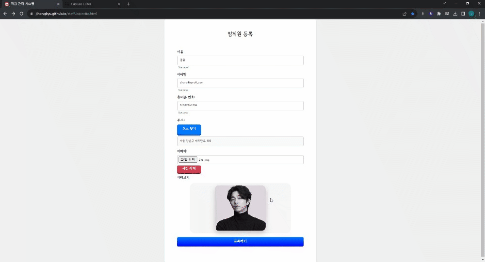
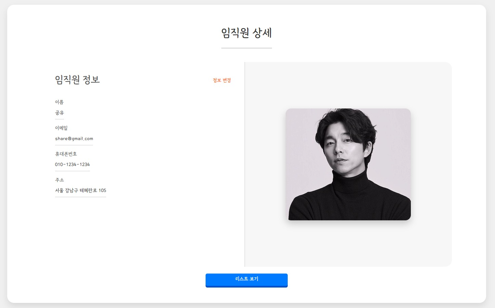
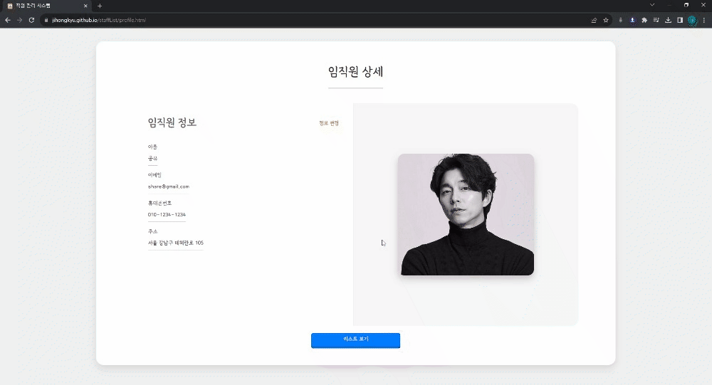
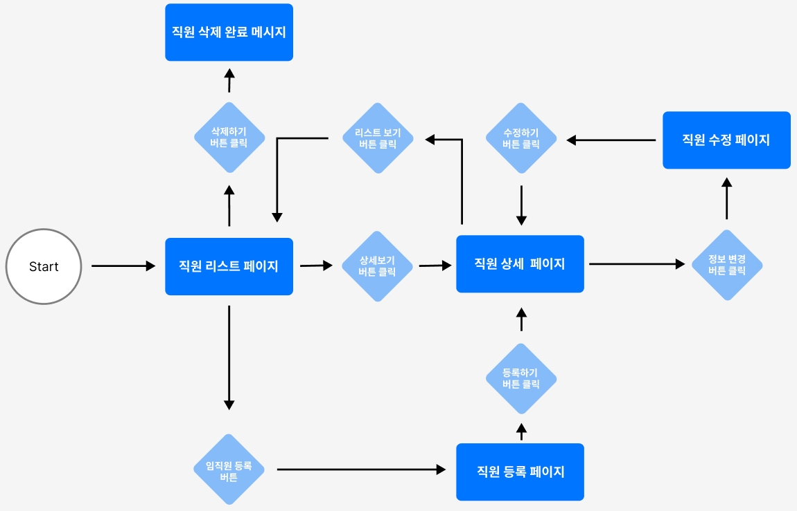

# 🙍‍♂️ 직원 관리 시스템

HTML, CSS, Javascript로 만든 직원 관리 시스템

➡️ [직원 관리 시스템 둘러보기](https://jihongkyu.github.io/staffList)

# 🖥️ 프로젝트 소개

직원 등록, 수정, 삭제가 가능한 직원 관리 시스템입니다.

- 목적: Vanilla JS 실력 향상을 위해 CRUD 구현

- 특이점: LocalStorage를 이용한 데이터 저장

# 📆 제작 기간

### 2023년 08월 08일 ~ 2023년 08월 18일

# 필수 요구사항

✅“AWS S3 / Firebase 같은 서비스”를 이용하여 사진을 관리할 수 있는 페이지를 구현

✅프로필 페이지를 개발

✅스크롤이 가능한 형태의 리스팅 페이지를 개발

✅전체 페이지 데스크탑-모바일 반응형 페이지를 개발

✅사진을 등록, 수정, 삭제가 가능

✅유저 플로우를 제작하여 리드미에 추가

✅CSS - 애니메이션 구현, 상대수치 사용(rem, em)

✅JavaScript - DOM event 조작

# 🚀 기술스택

# 📝 기능 구현

### 1. 리스트 페이지

- `table`태그로 리스트 구현
- 리스트 목록 `hover`시 구분가능하도록 리스트 색 변경

- Debounce를 활용하여 검색 기능 구현

- 리스트 목록 클릭 시 나오는 모달창 구현
- 모달창과 버튼 - 애니메이션으로 구현
- 상세보기 버튼 클릭 시 클릭한 직원의 상세 페이지로 이동
- 삭제하기 클릭 시 클릭한 직원 삭제

### 2. 직원 등록 페이지

- 유효성 검사 코드 작성
- 주소 API활용
- 사진 선택 시 미리보기 구현
- 사진 삭제 기능 구현
- 등록 시 이미지는 AWS S3에 저장, 직원 정보는 로컬스토리지에 저장

### 3. 직원 상세 페이지

- 직원 사진과 정보가 담긴 프로필 페이지 구현

### 4. 직원 수정 페이지

- 직원 정보, 사진 수정 기능 구현

### 5. 모바일 반응형

- `@media`를 사용하여 모바일 UI 구현

# 🙄 User Flow

# ✍ 개선 사항

- LocalStorage 대신 AWS나 firebase 스토리지에 정보 저장해보기
